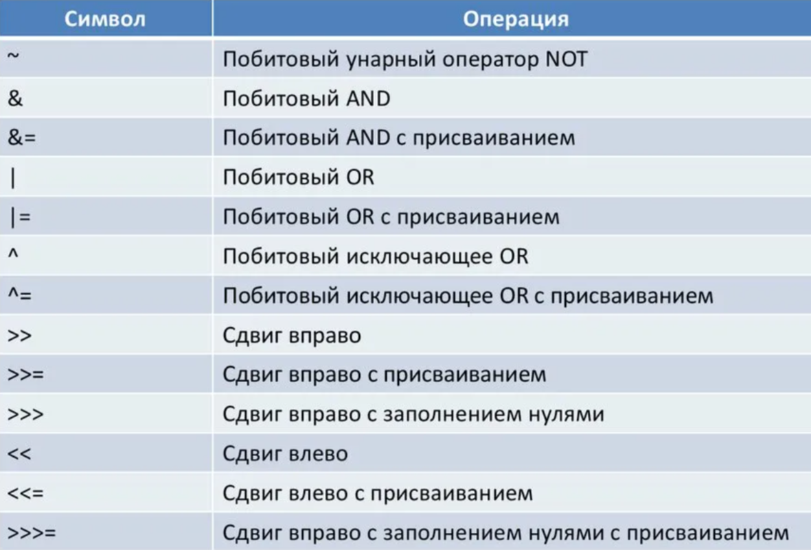
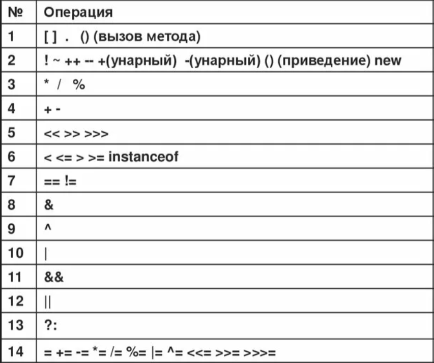

# Операции

Операции **инкремента** и **декремента** могут быть **префиксной** и **постфиксной** формах. В префиксной форме операнд 
инкрементируется или декрементируется перед получением значения для использования в выражении. В постфиксной - наоборот.

## Побитовые операции



В Java используется кодировка, известная как **дополнение до двух** или **дополнительный код**, которая предусматривает 
представление отрицательных чисел путём инвертирования всех битов в значении и последующего добавления единицы к результату.

При выполнении сдвига вправо старшие (крайние слева) биты, открытые биты, заполняются предыдущем содержимым старшего бита.
Это называется **расширением знака** и служит для сохранения знака отрицательных чисел при их сдвиге вправо.

Укороченные логические операции и/или имеют вид **&&** и **||** соответственно.

С операцией присваивания возможна цепочка присваиваний, так как операция = возвращает значение правого выражения.

В Java предусмотрена специальная тернарная операция, которая способна заменить определённые виды операторов "если-то-иначе":
```java
выражение1 ? выражение2 : выражение3;
```

## Приоритеты операций

