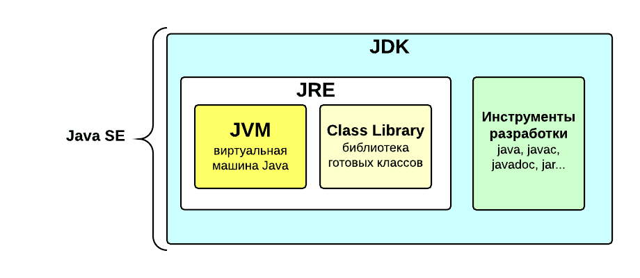
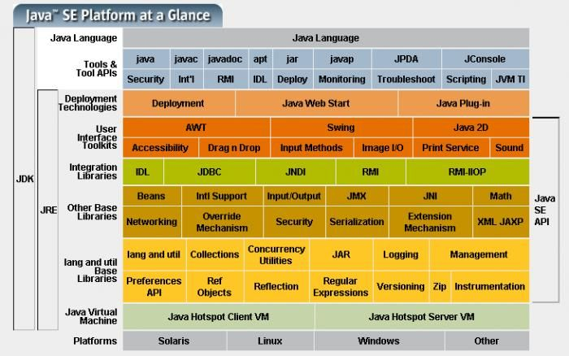
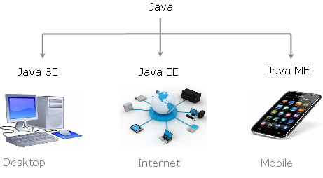

# История и эволюция языка Java

## Содержание

* README.md - конспект главы 1.
* *.png - картинки, которые используются в README.md.

## Конспект

Язык Java придумали в 1991 году выходцы из компании Microsystems, Inc. Первоначально язык получил название Oak, но в 
1995 году был переименован в Java.

В какой-то мере неожиданно, но первоначальной побудительной причиной создания Java был вовсе не Интернет. Взамен главной
движущей силой стала потребность в независимом от платформы (архитектурно-нейтральном) языке. Второй движущей силой стала
Всемирная паутина.

Язык Java наследует многие характеристики от языков C и C++. Основная особенность Java, которая позволила решить проблемы 
переносимости и безопасности, заключается в том, что компилятор Java генерирует не исполняемый код, а **байт-код**. Байт-код
представляет собой оптимизированный набор данных (инструкций), предназначенных для выполнения **виртуальной машиной Java**
(Java Virtual Machine - **JVM**), которая является частью **исполняющей среды Java** (Java Runtime Environment - **JRE**).
JVM входит в состав JRE, которая входит в состав **средств разработки Java** (Java Development Kit - **JDK**).

Более детально:

Мы работаем в **стандартной редакции Java** (Java Standard Edition - **JSE**) - основная версия для настольных и серверных
приложений. Также существует **Java Enterprise Edition - Java EE** (**Jakarta EE**). Это платформа для разработки и развертывания корпоративных 
приложений. Она включает в себя множество API и сервисов для построения масштабируемых, надежных и распределенных систем.
И стоит упомянуть **Java Micro Edition - Java ME**. Эта версия предназначена для разработки приложений для устройств с 
ограниченными ресурсами, таких как мобильные телефоны, встраиваемые системы и т.д. Она имеет меньший объем памяти и ресурсов, чем SE.

Добавим, что у Java SE постоянно происходят обновления. И существуют **LTS (Long-Term Support)**, то есть выпуск с долгосрочной
поддержкой. LTS версии Java SE: 8, 11, 17, 21 и скоро выйдет 25. За этим можно следить на сайте Oracle. 