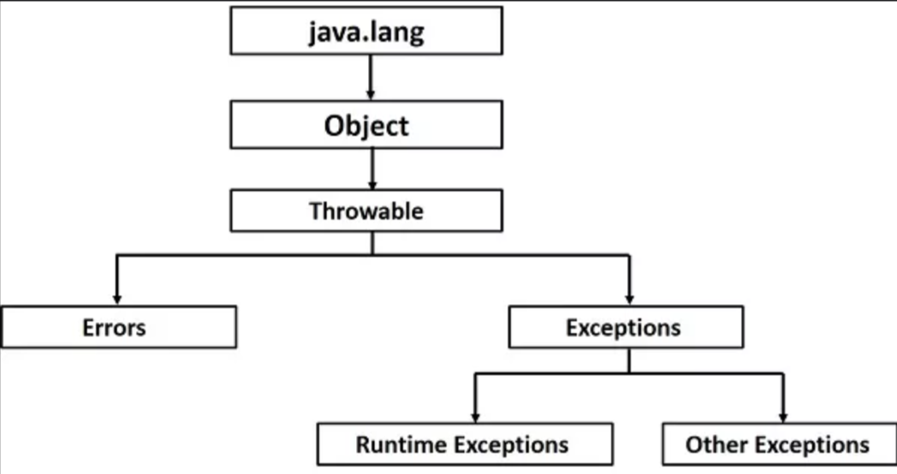
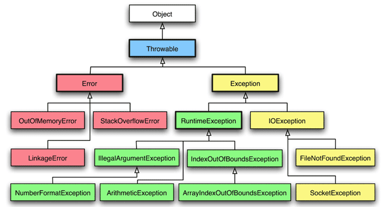

# Обработка исключений

## Содержание

* README.md - конспект клавы 10.
* *.png & *.gif - картинки, которые используются в конспекте.
* src/*.java - примеры программ из главы 10.

## Конспект

**Исключение** - это ненормальное состояние, которое возникает в кодовой последовательности во время выполнения. Исключение
является ошибкой времени выполнения.

Исключение Java представляет собой объект, описывающий исключительное (ошибочное) состояние, которое произошло внутри фрагмента кода.
При возникновении исключительного состояния в методе, вызвавшем ошибку, генерируется объект, представляющий это исключение.
Метод может обработать исключение самостоятельно или передать его дальше. Так или иначе, в какой-то момент исключение **перехватывается**
и **обрабатывается**.

Исключения могут быть сгенерированы исполняющей средой Java или вручную в коде. Исключения, генерируемые Java, относятся к фундаментальным ошибкам, 
которые нарушают правила языка Java или ограничения исполняющей среды Java. Исключения, сгенерированные вручную, обычно используются
для сообщения об ошибке вызывающей стороне метода.

Обработка исключений в Java управляется пятью ключевыми словами: **try**, **catch**, **throw**, **throws**, **finally**.
Операторы программы, которые вы хотите отслеживать на наличие исключений, содержаться в блоке **try**. Код может перехватить исключение
с помощью блока **catch** и обработать его. Системные исключения автоматически генерируются исполняющей средой Java. Для ручной
генерации исключения используйте ключевое слово **throw**. Любое исключение, генерируемое в методе, должно быть указано как таковое с помощью конструкции  
**throws**. Любой код, который обязательно должен быть выполнен после завершения блока **try**, помещается в блок **finally**.

```java
try{
    Оператор1;
    Оператор2;
    //...
} catch (Тип-исключения1 объект) {
   Оператор1;
   Оператор2;
   //...
} catch (Тип-исключения2 объект) {
   Оператор1;
   Оператор2;
   //...
}
//...
finally{
    Оператор1;
    Оператор2;
    //...
}
```

## Типы исключений

Все типы исключений являются подклассами встроенного класса **Throwable**. Непосредственно под Throwable находятся два подкласса,
которые разделяют исключения на две отдельные ветви. Одну ветвь возглавляет класс **Exception**, используемый для представления
исключительных условий, которые должны перехватываться пользовательскими программами. Он также будет служить подклассом для 
создания собственных специальных типов исключений. У Exception имеется важный подкласс **RuntimeException**. Исключение такого
типа автоматически определяются для разрабатываемых программ.

Другую ветвь возглавляет класс **Error**, определяющий исключения, которые не должны перехватываться программой в обычных условиях.
Исключения типа Error применяется исполняющей средой Java для указания ошибок, связанных с самой средой.



Самостоятельная обработка позволяет исправить ошибку и предотвращает автоматическое прекращение работы программы.

## Throws

Если метод способен приводить к исключению, которое он не обрабатывает, то метод должен сообщить о таком поведении, чтобы вызывающий его
код мог защитить себя от этого исключения. Задача решается добавлением к объявлению метода конструкции **throws**, где перечисляются
типы исключений, которые может генерировать метод. Поступать так необходимо для всех исключений, кроме исключений типа Error, RuntimeException или 
любых их подклассов.

```java
тип имя-метода(список-параметров) throws список-исключений {...}

//Пример
public static void main(String[] args) throws IOException, IllegalArgumentException {

}
```

## Встроенные исключения 

Внутри java.lang определено несколько классов исключений Java. Исключения бывают **проверяемые** (выделяются с помощью throws)
и **непроверяемые** (подклассы класса RuntimeException).

Чуть больше про структуру:


## Сцеплённые исключения 

**Сцеплённое исключение** позволяет ассоциировать с одним исключением другое исключение, которое описывает причину первого исключения.

Три дополнительных средства:
1) try с ресурсами
2) множественный перехват
3) более точная повторная генерация