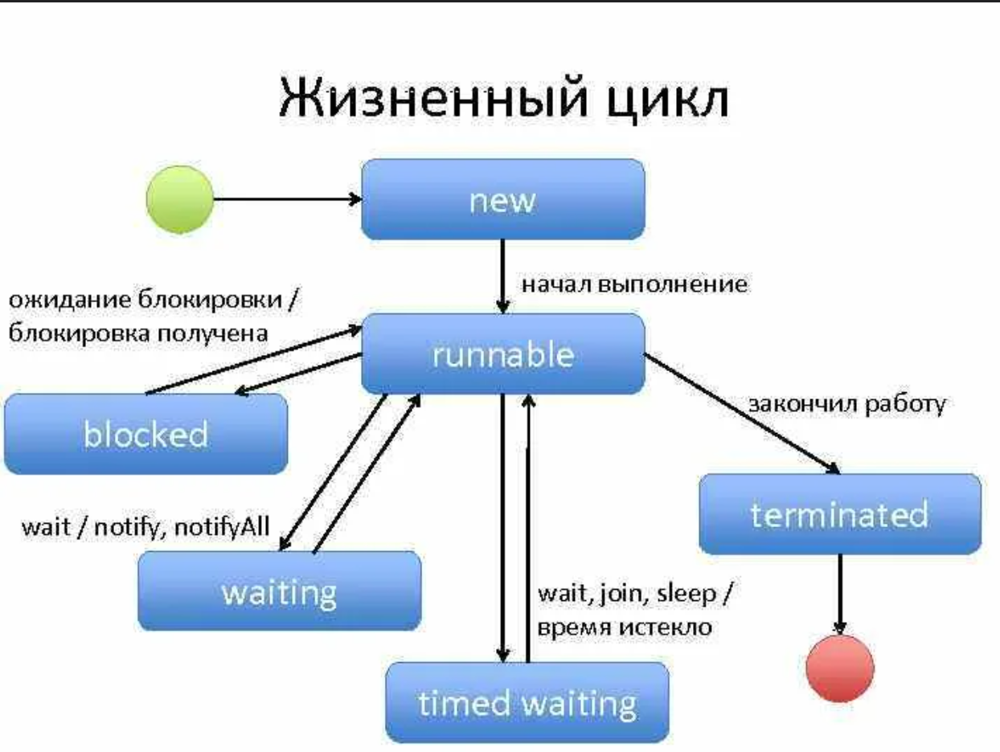

# Многопоточное программирование 

## Содержание

* README.md - конспект главы 11.
* State.png - картинка, которая используется в конспекте.

## Конспект

В языке Java обеспечивается встроенная поддержка многопоточного программирования.
Многопоточная программа состоит из двух или более частей,
которые могут выполняться одновременно. Каждая часть такой программы
называется **потоком**, и каждый поток определяет отдельный путь выполнения. Многопоточность представляет собой специализированную
форму многозадачности: **на основе потоков** и **на основе процессов**.

Потоки пребывают в нескольких состояниях. Поток может **выполняться**. Он может быть **готовым к запуску**, как
только получит время ЦП. Работающий поток может быть **приостановлен**, в
результате чего он временно прекращает свою активность. Выполнение приостановленного
потока затем можно **возобновить**, позволяя ему продолжиться
с того места, где он остановился. Поток может быть **заблокирован** при ожидании
ресурса. В любой момент работа потока может быть **прекращена**.

## Приоритеты потоков

Каждому потоку в Java назначается приоритет, который определяет способ
обработки данного потока в сравнении с другими потоками. Приоритеты
потоков представляют собой целые числа, определяющие относительный
приоритет одного потока над другим. Как абсолютная величина приоритет
не имеет смысла; поток с более высоким приоритетом не работает быстрее
потока с более низким приоритетом, если он является единственным функционирующим
потоком. Взамен приоритет потока применяется для принятия
решения о том, когда переключаться с одного работающего потока на другой.
Прием называется **переключением контекста**. Правила, которые определяют,
когда происходит переключение контекста, просты и описаны ниже.
1) Поток может добровольно передать управление.
2) Поток может быть вытеснен потоком с более высоким приоритетом.

## Синхронизация

Поскольку многопоточность привносит асинхронное поведение в ваши
программы, должен быть способ обеспечения синхронности, когда она необходима.
Скажем, если вы хотите, чтобы два потока взаимодействовали и
совместно использовали сложную структуру данных, такую как связный список,
то вам нужен способ предотвращения конфликтов между ними. То есть
вы должны запретить одному потоку записывать данные, пока другой поток
находится в процессе их чтения. Для этой цели в Java реализован элегантный
вариант старой модели синхронизации между процессами: монитор. **Монитор**
представляет собой механизм управления. Вы можете думать о мониторе как об очень маленьком "ящике";
способном содержать только один поток. Как только поток входит в монитор,
все остальные потоки должны ждать, пока этот поток не выйдет из монитора.
Таким образом, монитор можно применять для защиты общего ресурса от
манипулирования более чем одним потоком одновременно.

В Java нет класса, который назывался бы "Monitor"; взамен каждый объект
имеет собственный неявный монитор, в который автоматически осуществляется
вход при вызове одного из синхронизированных методов объекта. Как
только поток оказывается внутри синхронизированного метода, остальные
потоки не могут вызывать какой-либо другой синхронизированный метод
для того же объекта. Это позволяет писать очень ясный и лаконичный многопоточный
код, поскольку в язык встроена поддержка синхронизации.

## Thread & Runnable

Многопоточная система Java построена на основе класса **Thread**, ero методах
и дополняющем интерфейсе **Runnable**. Класс Thread инкапсулирует
поток выполнения. Чтобы создать новый поток, ваша программа либо расширит класс Thread,
либо реализует интерфейс Runnable.

Методы класса Thread:
1) getName();
2) getPriority();
3) isAlive();
4) join() - ожидает прекращения работы потока;
5) run() - устанавливает точку входа в поток;
6) sleep();
7) start() - запускает поток.

## Главный поток

Когда программа Java запускается, немедленно начинает выполняться один
поток. Обычно его называют **главным потоком** программы, потому что именно
он выполняется при ее запуске. Главный поток важен по двум причинам:
* он является потоком, из которого будут порождаться другие "дочерние"
потоки;
* часто он должен заканчивать выполнение последним, поскольку выполняет
разнообразные действия по завершению работы.

**Группа потоков** представляет собой структуру данных, которая управляет состоянием набора потоков в целом.

Для синхронизации используются либо ключевое слово **synchronized** в заголовке метода, либо синхронизированный блок:

```java
synchronized (objRef) {
   //... 
}
```

## Взаимодействие между потоками

В Java имеется элегантный механизм взаимодействия между процессами
с помощью методов **wait**(), **notify***() и **notifyAll**(), который позволяет
избежать опроса. Указанные методы реализованы как финальные в классе
Object, поэтому они есть во всех классах. Все три метода можно вызывать
только из синхронизированного контекста. Хотя они концептуально сложны
с вычислительной точки зрения, правила их применения в действительности
довольно просты.
* Метод wait() сообщает вызывающему потоку о необходимости уступи
ть монитор и перейти в спящий режим, пока какой-то другой поток
не войдет в тот же монитор и не вызовет notify() или notifyAll().
* Метод notify() пробуждает поток, который вызвал wait() на том же
самом объекте.
* Ме тод notifyAll() пробуждает все потоки, которые вызвали wait()
на том же самом объекте. Одному из этих потоков будет предоставлен
доступ.

## Взаимоблокировка

Важно избегать особого вида ошибок, связанного именно с многозадачностью
и называемого **взаимоблокировкой**, которая возникает в ситуации, когда
два потока имеют циклическую зависимость от пары синхронизированных
объектов.

## Приостановка, возобновление и останов потоков

Механизм приостановки, остановки и возобновления потоков различаются между ранними версиями Java: **suspend()**, **resume()** и **stop()**.
Они являются нерекомендуемыми из-за того, что могут стать причиной серьёзных системных отказов.

## getState()

* **BLOCKED** - поток приостановил выполнение, потому что ожидает
получения блокировки.
* **NEW** - поток еще не начал выполнение.
* **RUNNABLE** - поток либо в текущий момент выполняется, либо будет
  выполняться, когда получит доступ к ЦП.
* **TERMINATED** - поток завершил выполнение.
* **TIMED_WAITING** - поток приостановил выполнение на указанный период
  времени, например, при вызове sleep (). Поток
  переходит в это состояние также в случае вызова версии
  wait() или join(), принимающей значение тайм-аута.
* **WAITING** - поток приостановил выполнение из-за того, что ожидает
  возникновения некоторого действия. Например, он
  находится в состоянии WAITING по причине вызова версии
  wait() или join(), не принимающей значение тайм-аута.

