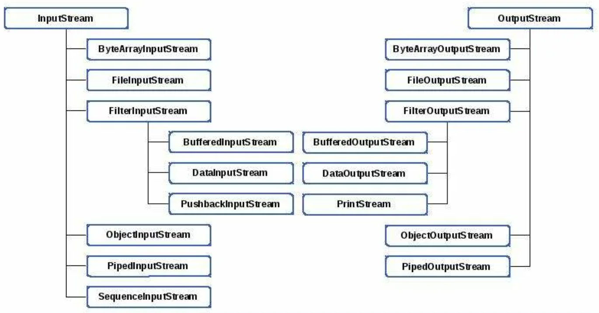
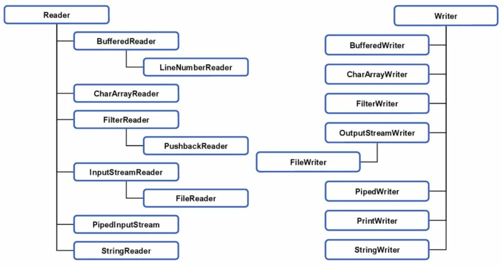

# Ввод-вывод, оператор try с ресурсами и другие темы

## Содержание

* README.md - конспект главы 13.
* *.png - картинки, который используются в конспекте.
* src/*.java - примеры программ из главы 13.

## Конспект

## Потоки данных

**Поток данных (stream)** - это абстракция, которая либо производит, либо потребляет информацию. Ввод-вывод выполняется
через потоки данных. Поток связан с физическим устройством посредством системы ввода-вывода Java. Все потоки ведут себя одинаково,
даже если фактические физические устройства, с которыми они связаны, различаются. Потоки данных Java являются чистым способом
работы с вводом-выводом, при котором в каждой части вашего кода не требуется учёт отличий, например, между клавиатурой и сетью.
Потоки данных Java реализованы внутри иерархии классов, определённых в пакете **java.io**. В дополнение к потоковому вводу-выводу язык
Java также предоставляет ввод-вывод на основе буферов и каналов, который определён в **java.nio**.

В Java определены два типа потоков ввода-вывода: **байтовые** и **символьные**. **Потоки байтовых данных** предлагают удобные средства
для обработки ввода и вывода байтов. Они используются, например, при чтении или записи двоичных данных. **Потоки символьных данных** предоставляют
средства для обработки ввода и вывода символов. Они применяют Unicode. В ряде случаев потоки символьных данных эффективнее
потоков байтовых данных.

На самом низком уровне все операции ввода-вывода по-прежнему ориентированы на байты. Потоки символьных данных просто обеспечивают удобный
и эффективный инструмент для обработки символов.

## Классы потоков байтовых данных 

Потоки байтовых данных определяются с применением двух иерархий классов. Вверху находятся два абстрактных класса: **InputStream** и **OutputStream**.
Каждый из них имеет несколько конкретных подклассов, которые справляются с отличиями между разными устройствами, такими как дисковые 
файлы, сетевые подключения и даже буферы памяти.



1) (Input/Output)Stream - абстрактный класс, который описывает поток (ввода/вывода).
2) **ByteArray**(Input/Output)Stream - поток (ввода/вывода), который выполняет (чтение/запись) (из/в) байтовый массив.
3) **File**(Input/Output)Stream - поток (ввода/вывода) выполняющий (чтение/запись) (из/в) файл.
4) **Filter**(Input/Output)Stream - реализует (Input/Output)Stream.
5) **Buffered**(Input/Output)Stream - буферизованный поток (ввода/вывода).
6) **Data**(Input/Output)Stream - поток (ввода/вывода), который содержит методы для (чтения/записи) стандартных типов данных Java.
7) **PushbackInputStream** - поток ввода, который позволяет возвращать байты в этот поток ввода.
   **PrintStream** - поток вывода, который содержит методы print() & println().
8) **Object**(Input/Output)Stream - поток (ввода/вывода) для объекта.
9) **Piped**(Input/Output)Stream - канал (ввода/вывода).
10) **SequenceInputStream** - поток ввода, являющийся комбинацией двух и более потоков ввода, которые будут читаться последовательно друг за другом.

## Классы потоков символьных данных 

Потоки символьных данных определяются с помощью двух иерархий классов. Вверху находятся два абстрактных класса: **Reader** & **Writer**.
Они обрабатывают потоки символов Unicode.



1) (Reader/Writer) - абстрактный класс, описывающий поток (ввода/вывода) символьных данных.
2) **Buffered**(Reader/Writer) - буферизованный поток (ввода/вывода).
3) **LineNumberReader** - поток ввода, который подсчитывает строки.
4) **CharArray**(Reader/Writer) - поток (ввода/вывода), который выполняет (чтение/запись) (из/в) символьный массив.
5) **Filter**(Reader/Writer) - фильтрующее средство (чтения/записи).
6) **PushbackReader** - поток ввода, который позволяет возвращать байты в этот поток ввода.
7) (Input/Output)**Stream**(Reader/Writer) - поток (ввода/вывода), который выполняет трансляцию (байтов в символы/символов в байты).
8) **File**(Reader/Writer) - поток (ввода/вывода), который выполняет (чтение/запись) (из/в) файл.
9) **Piped**(Reader/Writer) - канал (ввода/вывода).
10) **PrintWriter** - поток вывода, который содержит методы print() и println().
11) **String**(Reader/Writer) - поток (ввода/вывода), который выполняет (чтение/запись) (из/в) строку.

Все программы на Java автоматически импортируют пакет java.lang, в котором определён класс System, инкапсулирующий ряд аспектов
исполняющей среды. Класс **System** также содержит три предопределённых потоковые переменные: **in**, **out** и **err**.
Они объявлены как public, static и final.

Поле System.out ссылается на стандартный поток вывода. По умолчанию это консоль. Поле System.in ссылается на стандартный поток
ввода, в качестве которого по умолчанию выступает клавиатура. Поле System.err ссылается на стандартный поток вывода ошибок,
по умолчанию также является консолью. Однако эти потоки могут быть перенаправлены на любое совместимое устройство ввода-вывода.

System.in объект типа InputStream, а System.out и System.err объекты типа PrintStream.

## Автоматическое закрытие файла

Средство, называемое **автоматическим управлением ресурсами**, основано на расширенной версии оператора try. Главное преимущество 
связано с тем, что оно предотвращает ситуации, в которых файл (или другой ресурс) не освобождается после того, как он больше не 
нужен. Игнорирование закрытия файла может привести к утечкам памяти и прочим проблемам. **Try с ресурсами**:

```java
try(спецификация-ресурса){
   //use resource 
}
```

Оператор try с ресурсами можно применять только с теми ресурсами, которые реализуют интерфейс **AutoCloseable**, который 
унаследован интерфейсом **Closeable**. Оба интерфейса реализованы классами потоков.

При использовании оператора try с ресурсами, в ситуации когда исключение внутри try приведёт к возникновению другого исключения во время
закрытия ресурса, старое исключение подавляется. Список подавленных исключений можно получить с помощью getSuppressed().

## Модификаторы transient & volatile

Когда переменная экземпляра объявлена как transient, её значение не должно предохраняться при сохранении объектов, то есть
при сериализации оно будет утеряно и не будет десериализовано.

Модификатор volatile уведомляет компилятор о том, что снабжённая им переменная может быть неожиданно изменена другими частями 
программы. Изменения, внесенные в переменную одним потоком, будут немедленно видны другим потокам.

## instanceof

```java
objref instanceof type
```

Если аргумент objref относится к указанному типу или может быть к нему приведён, то возвращает true, иначе - false.
Можно получать информацию и типе объекта во время выполнения.

## Модификатор strictfp

За счет добавления к классу, методу или интерфейсу модификатора strictfp можно гарантировать, что вычисления с плавающей точкой
будет выполняться точно так же, как в более ранних версиях Java. Начиная с JDK 17, все вычисления с плавающей точкой являются строгими, 
а модификатор strictfp устарел и больше не обязателен.

## Модификатор native

Может понадобиться вызвать подпрограмму, которая написана не на языке Java. Язык Java прелагает ключевое слово native, которое
применяется для объявления собственного кода.

## assert

Оно применяется на стадии разработки программы для создания утверждения-условия, которое должно быть истинным во время выполнения 
программы. Если во время выполнения условие истинно, то ничего не происходит; в противном случае генерируется объект AssertionError.

```java
assert condition;
assert condition: expr;
```

**-ea** - подключение проверки;
**-da** - отключение проверки.

## Статическое импортирование

За счет снабжения оператора import ключевым словом static этот оператор можно применять для импортирования статических членов класса
или интерфейса. В этом случае к статическим членам можно получать доступ напрямую по их именам, не уточняя именем класса,
что упрощает и сокращает синтаксис.

```java
import static pkg.type-name.static-member-name;
```

## Вызов перегруженных конструкторов

```java
this(arg-list);
```

В вызове this() нельзя применять переменную экземпляра класса конструктора. В одном и том же конструкторе нельзя использовать
вызовы super() и this().