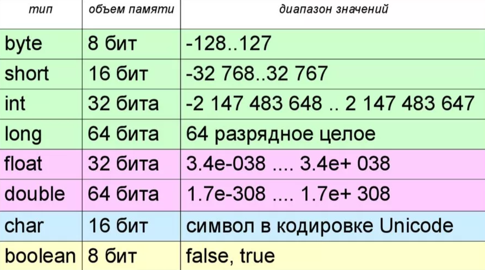
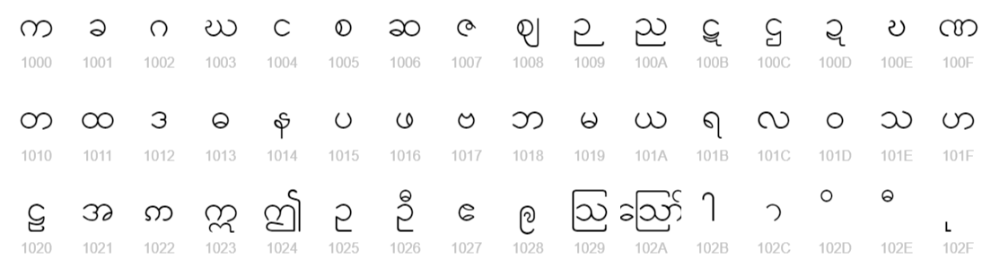

# Типы данных, переменные и массивы

## Содержание

* README.md - конспект главы 3.
* *.png - картинки, которые используются в конспекте.
* src/*.java - примеры кода из главы 3.

## Конспект

Java строго типизированный язык программирования. Это означает, что у каждой переменной есть тип, у каждого выражения есть 
тип, и каждый тип строго определён. Все присваивания, как явные, так и через передачу параметров в вызовах методов, проверяются
на совместимость типов.

В Java определены восемь **примитивных** (простых) типов данных:



Для представления символов в Java применяется Unicode. Кодировка Unicode определяет полностью международный набор символов,
с помощью которого можно представить все символы, встречающиеся во всех естественных языках.
Пример:



Хотя тип char предназначен для хранения символов Unicode, его также можно применять как целочисленный тип, с которым допускается
выполнять арифметические операции.

## Литералы

В целочисленных литералах допускается применять ещё три вида чисел - двоичные, восьмеричные и шестнадцатеричные.
Перед двоичными необходимо написать **0b** или **0B**, перед восьмеричными просто **0**, а перед шестнадцатеричными - **0x** или **0X**.

Для создания литерала типа long нужно добавить к литералу букву **l** или **L**.

В целочисленных литералах можно указывать один или несколько символов подчёркивания. При компиляции литерала символы подчёркивания
отбрасываются.

Литералы с плавающей точкой можно записывать как в **стандартной**, так и в **научной** формах записи: 2.0, 2e+100, 2E-3.

Литералы с плавающей точкой в Java по умолчанию имеют тип double. Для указания литерала типа float к константе необходимо
добавить букву **F** или **f**. Можно также явно указывать литерал double, добавляя букву **D** ил **d**, хотя поступать 
так излишне.

Шестнадцатеричные литералы с плавающей точкой записываются в форме, похожей на научную, но вместо **E** или **e** используется 
буква **P** или **p**. Значение после p, называемое двоичным показателем степени, указывает степень двойки, на которую умножается
число. В этих литералах также можно ставить знаки подчёркивания.

Литерал true не равен 1, а false - нулю.

Символьные управляющие последовательности:
* \ddd - восьмеричный символ;
* \u xxxx - шестнадцатеричный символ Unicode;
* \\' - одинарная кавычка;
* \\" - двойная кавычка;
* \\\ - обратная косая черта;
* \r - возврат каретки;
* \n - новая строка;
* \t - табуляция;
* \s - пробел.

В отношении строковых литералов Java важно помнить, что они должны начинаться и заканчиваться в той же строчке, даже если она
перенесена.

Когда значение одного типа присваивается переменной другого типа, **автоматическое преобразование типов** происходит в случае
удовлетворения следующих двух условий:
* два типа совместимы;
* целевой тип больше исходного.

При соблюдении указанных двух условий выполняется **расширяющее преобразование**.

**Приведение** представляет собой просто явное преобразование типа и имеет следующую форму:
```java
(целевой тип) значение; 
```
При вычислении выражения каждый операнд типа byte, short, char автоматически повышается до int. Если один операнд имеет тип
long, то всё выражение повышается до long. Если какой-либо из операндов имеет тип double, то результат будет иметь тип double.

## Массивы

**Массив** - это группа переменных одного типа, к которой можно обращаться по общему имени.

```java
тип[] имя-переменной;
```
Общая форма операции new применительно к одномерным массивам выглядит так:

```java
имя-переменной = new тип[размер];
```

Элементы в массиве, размещенном в памяти операцией new, будут автоматически инициализированы нулём для числовых типов, значением
false для булевского типа или значением null для ссылочных типов.

**Инициализатор массива** представляет собой список разделённых запятыми выражений, заключённых в фигурные скобки.

Многомерные массивы в Java реализованы как массивы массивов. При размещении многомерного массива необходимо указывать 
память только для первого измерения. Остальные можно размещать по отдельности.

Многомерные массивы можно инициализировать. Для этого просто заключите инициализатор каждого измерения в собственный набор
фигурных скобок.

Существует вторая форма объявления массива:

```java
тип имя-переменной[];
```

Выведение типов var:
* упрощение кода;
* упрощение объявления;
* решение трудного различия типа.