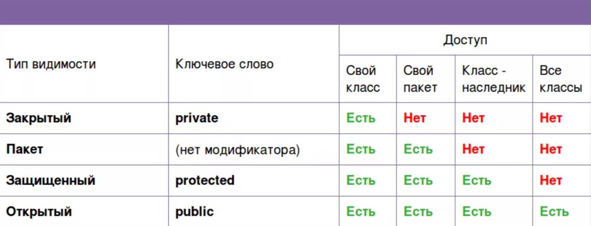

# Пакеты и интерфейсы

## Содержание 

* README.md - конспект главы 9.
* Package.png - картинка, использующаяся в конспекте.

## Пакеты

**Пакет** является как механизмом именования, так и механизмом видимости. 

Создать пакет довольно легко: понадобится просто поместить в начало файла оператор **package**. Любые классы, объявленные в данном файле, будут принадлежать
пакету. Оператор package определяет пространство имён, в котором хранятся классы. Если оператор отсутствует, тогда имена классов 
помещаются в **стандартный пакет**, не имеющий имени.

```java
package пакет;
```

Как правило, в Java для хранения пакетов применяются каталоги файловой системы.

Допускается создавать иерархию пакетов, для чего нужно просто отделять имя каждого пакета от имени пакета над ним с помощью точки.

Иерархия пакетов должна быть отражена в файловой системе на машине для разработки приложений Java.

Имена пакетов должны выбираться крайне аккуратно, так как нельзя переименовать пакет, не переименовав каталог, в котором
хранятся классы.

Классы и пакеты являются средствами инкапсуляции и содержания в себе пространства имён, а также области видимости переменных 
и методов. Пакеты действуют в качестве контейнера для классов и других подчинённых пакетов. Классы действуют как контейнеры для данных и кода.
Класс - это наименьшая единица абстракции Java.



Класс, не являющийся вложенным, имеет только два возможных уровня доступа: стандартный и открытый. Когда класс является 
открытым, он должен быть единственным открытым классом, объявленным в файле, а файл должен иметь такое же имя, как у класса.

В составе Java имеется оператор импортирования **import**, который позволяет вделать видимыми определённые классы или целые пакеты.

В файле с исходным кодом на Java операторы import располагаются сразу после оператора package и перед любыми определениями классов.

В любом месте, где указывается имя класса, можно применять его полностью уточнённое имя, которое включает в себя всю иерархию пакетов.

## Интерфейсы

С помощью ключевого слова **interface** вы можете полностью абстрагировать интерфейс класса от его реализации. То есть можно указать, что класс должен делать, но не как конкретно.
Интерфейсы синтаксически похожи на классы, но в них отсутствуют переменные экземпляра и, как правило, их методы объявляются без тела.
После определения интерфейс может быть реализован любым количеством классов. Кроме того, один класс может реализовать любое количество интерфейсов.

Поскольку интерфейсы находятся в иерархии, отличающейся от иерархии классов, у классов, не связанных с точки зрения иерархии классов, 
появляется возможность реализовать один и тот же интерфейс.

Внутри интерфейса можно объявлять переменные, которые неявно являются final и static. Все методы и переменные неявно открыты.

Для реализации интерфейса включите в определение класса конструкцию **implements**.

Методы, реализующие интерфейс, должны быть объявлены как public. Кроме того сигнатура типов реализующего метода должна в точности совпадать
с сигнатурой типов, указанной в определении интерфейса.

Если класс включает интерфейс, но не полностью реализует методы, требуемые этим интерфейсом, то такой класс должен быть объявлен абстрактным.

Интерфейс может быть объявлен членом класса или другого интерфейса. Такой интерфейс называется **вложенным интерфейсом**. 
Вложенный интерфейс может быть объявлен как public, private, protected. Когда вложенный интерфейс применятся за пределами
своей области видимости, то он должен быть уточнён именем класса или интерфейса, членом которого является.

Интерфейсы можно использовать для импортирования общих констант в несколько классов, просто объявив интерфейс, который содержит переменные, 
инициализированные нужными значениями.

С помощью ключевого слова extends один интерфейс может быть унаследован от другого. Синтаксис используется такой же, как и при
наследовании классов. Когда класс реализует интерфейс, унаследованный от другого интерфейса, он должен предоставлять реализации
для всех методов требуемых интерфейсами в цепочке наследования.

**Стандартный метод** позволяет определить реализацию по умолчанию для метода интерфейса. Стандартный метод интерфейса определяется аналогично 
определению метода в классе. Основное отличие связано с тем, что объявление предваряется ключевым словом **default**.

В интерфейсе можно определять статические методы, но они не наследуются ни кем.

Интерфейс способен содержать закрытый метод, который может вызываться только стандартными методами или другим закрытым методом,
определённым в том же интерфейсе (не наследуется).